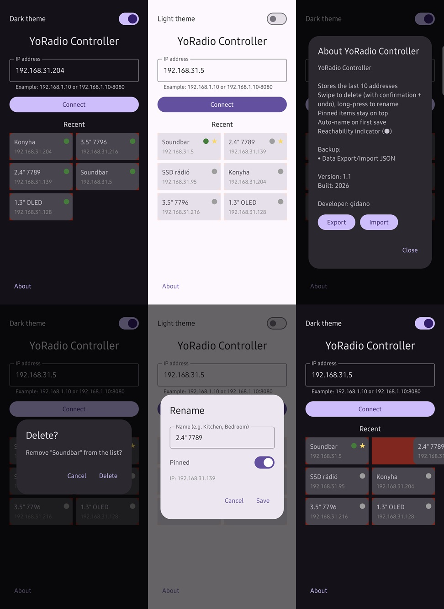

# YoRadio-Controller
For accessing the ëRadio web radio web server.

Android SDK 24-36 (can be used from Android 7 Nougat)

Main features:
-light/dark theme
-IP address storage (10), most recently used sorted first
-long press to rename, swipe to delete (with confirmation, can be undone for up to 3 seconds!)
-items can be pinned to the top of the list, as favorites
-auto-rename window after connecting to an unknown IP
-indicator dot in the upper right corner of the name field to show connection status
-Database export/import in .json format for stored devices
-Enjoy using it as much as we enjoyed creating it!

The application is in English! (The YoRadio web server interface is also in English, so I didn't see the point in adding language translation options)

  

Magyar nyelven

# YoRadio-Controller
A ëRadio webrádió webszerver eléréséhez.

Android SDK 24-36 (Android 7 Nougat-tól használható)

Főbb funkciói:
-világos-sötét téma
-IP-cím eltárolás (10db), a legutóbb használt előre sorolva
-az elemre hosszan nyomva átnevezhető, oldalra húzva törölhető (megerősítéssel, 3mp-ig visszavonható!)
-elemek kitűzhetők a lista elejére, kvázi Kedvencként
-még ismeretlen IP csatlakozása után auto-átnevezés ablak
-névmező jobb felső sarkában indikátor pötty az elérési állapot jelölésére
-a tárolt eszközökről adatbázis export/import .json formátumban
-használd olyan örömmel, amilyennel készült!

Az alkalmazás angol nyelvű! (A YoRadio webszerver kezelőfelülete is angol nyelvű, ezért nem láttam értelmét a nyelvi fordítási lehetőségeknek)

